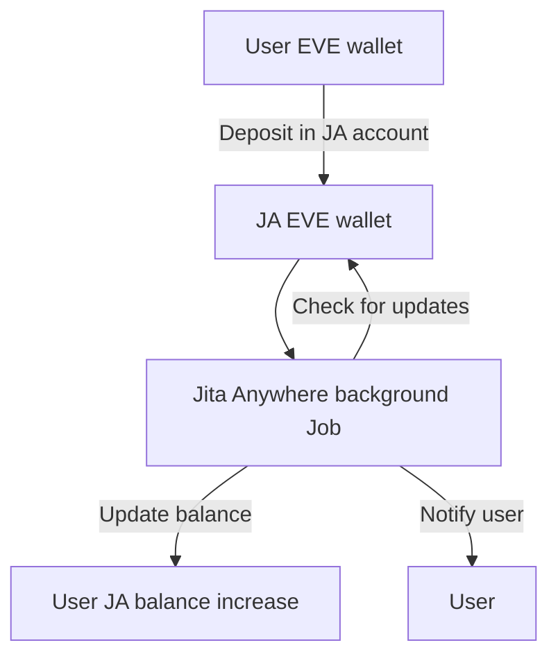
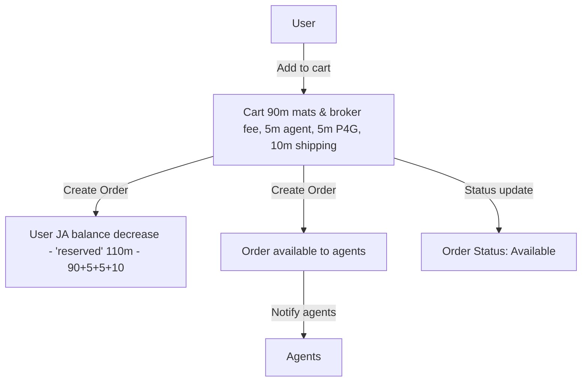
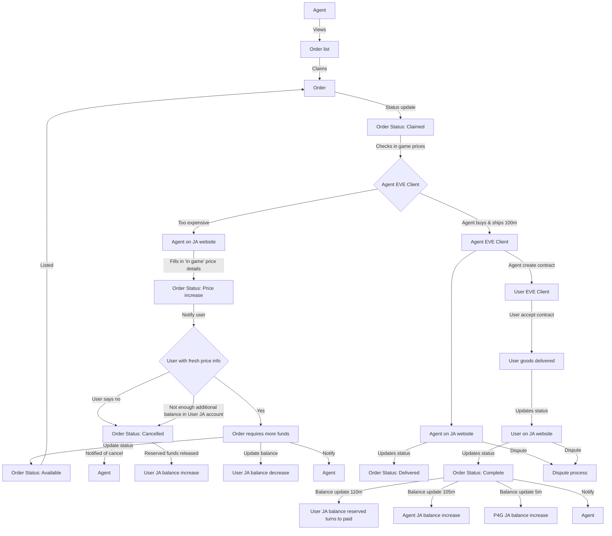
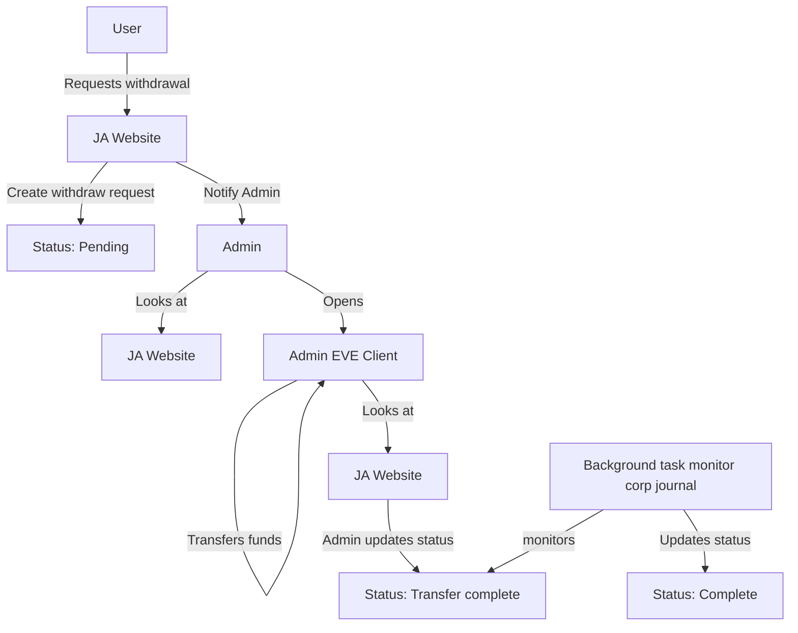
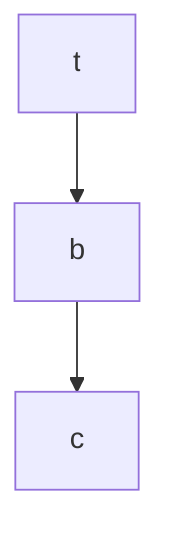

# Jita Anywhere
> Buy EVE goods away from your desk, all profits go to Plex For Good - [jita-anywhere.netlify.app](https://jita-anywhere.netlify.app)

## What is it about?
- Public website - [jita-anywhere.netlify.app](https://jita-anywhere.netlify.app)
- It's a way for users to buy items when they are are away from their PCs, on their mobiles or wherever the are in the world
- It introduces a new style of role for EVE players in the form of a 'shopping agent', where you can be paid to fulfil users' orders
- Backed and supported by CSM member Oz and the team
- Profits do not go to players, it goes to Plex For Good

## Technical Overview
- Simple solid.js UI
- Static site hosted UI
- All server-side functionality hosted in lambda functions (currently a mono-lambda)
- Hosted primarily on netlify
- Heroku hosted scheduled services
- ZERO run time costs. All currently within free tier. Minus the domain name.

## Getting Started - Development
- Install node.js and `npm i`
- Setup a mongodb instance, can be anywhere
- Setup EVE Online SSO application - eg, for local and production
- Rename `.env.example` to `.env`
- Populate environment variables
- You can run `npm run generate-data` to download, process and prepare data set from EVE SDE
- Install and configure `netlify dev` for local development
- Run local development by running `netlify dev` - Which builds local front and netlify local lambda function APIs

## Prod Deployment
- Configure netlify environment variables
- Link netlify to github for automated deployments
- Heroku is used for scheduled services (polling newly created contracts, checking corp transactions and updating payments etc) - Add heroku scheduler plugin and configure to run `node backend/scheduled-service/job.js` every 10 minutes. Disable web dynos

Process Flow Details

### Add funds

### User Checkout

### Order fulfilment

### Fund withdrawal, including plex for good

### Dispute process

### Process of orders with no changes (unattractive orders, unresponsive agents, unresponsive users)

