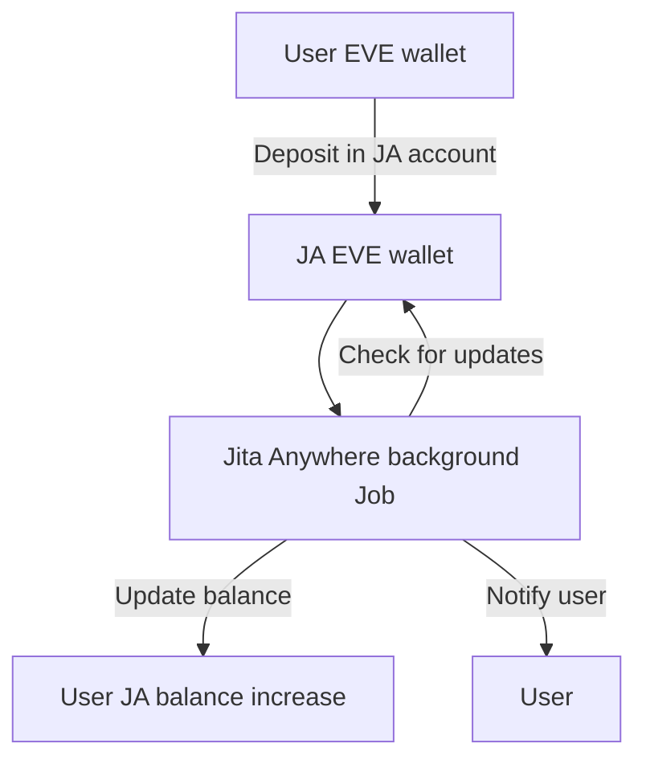
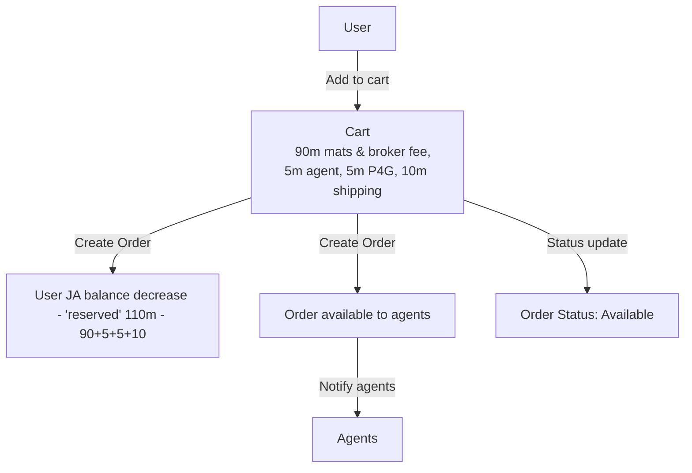
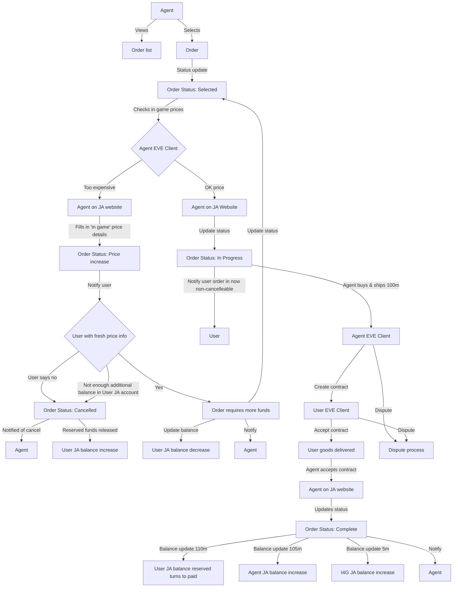
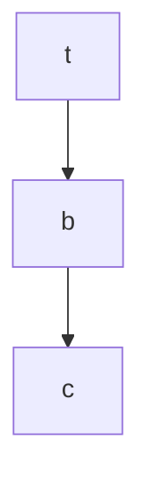

# Jita Anywhere

Add funds

```mermaid
flowchart TD

    a1[User EVE wallet] -- Deposit in JA account --> a2[JA EVE wallet];
    a3[Jita Anywhere background Job]-- Check for updates-->a2;
    a2 -->a3;
    a3 -- Update balance --> a4[User JA balance increase];
    a3 -- Notify user --> a5[User];

```

User Checkout

```mermaid
flowchart TD

    b1[User] -- Add to cart --> b2[Cart
    90m mats & broker fee, 5m agent, 5m P4G, 10m shipping];
    b2 -- Create Order --> b3[User JA balance decrease - 'reserved' 110m - 90+5+5+10];
    b2 -- Create Order --> b4[Order available to agents];
    b2 -- Status update --> b5[Order Status: Available];
    b4 -- Notify agents --> b7[Agents];

```

Order fulfilment

```mermaid
flowchart TD

    c1[Agent] -- Views --> c2[Order list];
    c1[Agent] -- Selects --> c3[Order];
    c3 -- Status update --> c4[Order Status: Selected];
    c4 -- Checks in game prices --> c5{Agent EVE Client};
    c5 -- Too expensive --> c6[Agent on JA website];
    c6 -- Fills in 'in game' price details --> c8[Order Status: Price increase];
    c8 -- Notify user --> c9{User with fresh price info};

    c9 -- User says no --> c10[Order Status: Cancelled];
    c9 -- Not enough additional balance in User JA account  --> c10;
    c9 -- Yes --> c12[Order requires more funds];

    c10 -- Notified of cancel --> c11[Agent];
    c10 -- Reserved funds released --> c13[User JA balance increase];

    c12 -- Update balance --> c14[User JA balance decrease];
    c12 -- Update status --> c4;
    c12 -- Notify --> c12a[Agent];
    c5 -- OK price --> c7[Agent on JA Website];
    c7 -- Update status --> c15[Order Status: In Progress];
    c15 -- Notify user order in now non-cancelleable  --> c15a[User];
    c15 -- Agent buys & ships 100m --> c16[Agent EVE Client];
    c16 -- Create contract --> c17[User EVE Client];
    c17 -- Accept contract --> c18[User goods delivered];
    c18 -- Agent accepts contract --> c19[Agent on JA website];
    c19 -- Updates status --> c20[Order Status: Complete];
    c20 -- Balance update 110m --> c21[User JA balance reserved turns to paid];
    c20 -- Balance update 105m --> c22[Agent JA balance increase];
    c20 -- Balance update 5m --> c23[I4G JA balance increase];
    c20 -- Notify --> c25[Agent]

    c16-- Dispute --> c24[Dispute process];
    c17 -- Dispute --> c24;

```
Fund withdrawal

```mermaid
flowchart TD

    t --> b --> c;
    
```